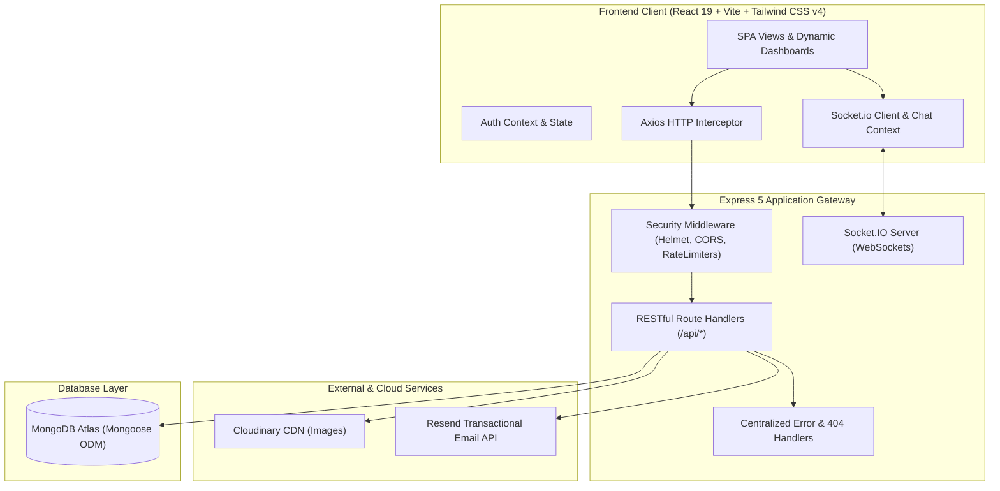
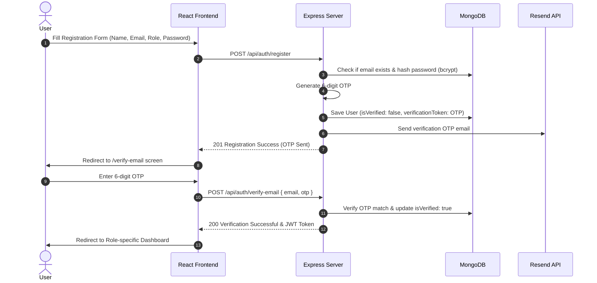
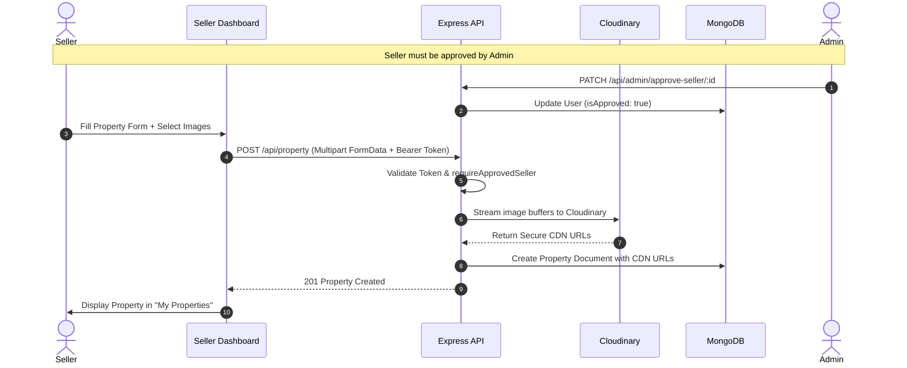
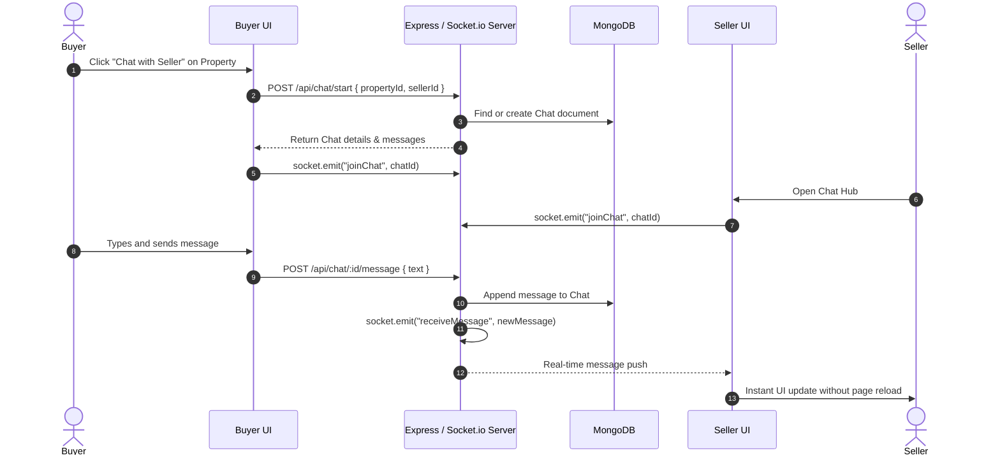

# 🏡 Haven — Full-Stack Real Estate Management & Marketplace Platform

<div align="center">

[](https://opensource.org/licenses/ISC)
[](https://react.dev/)
[](https://vitejs.dev/)
[](https://tailwindcss.com/)
[](https://nodejs.org/)
[](https://expressjs.com/)
[](https://www.mongodb.com/)
[](https://socket.io/)
[](https://cloudinary.com/)
[](https://resend.com/)

**A modern, production-ready enterprise real estate marketplace connecting buyers, sellers, and administrators with real-time chat, cloud media pipelines, role-based workflows, and intelligent analytics.**

[Explore Live Demo](https://suryaworks.xyz) • [Report Bug](https://github.com/surya-g25/RealEstate-Management-System/issues) • [Request Feature](https://github.com/surya-g25/RealEstate-Management-System/issues)

</div>

---

## 📑 Table of Contents

- [Overview](#-overview)
- [System Architecture](#-system-architecture)
- [Key Features & Role Capabilities](#-key-features--role-capabilities)
  - [Buyer & Public Visitors](#1-buyer--public-visitors)
  - [Property Sellers](#2-property-sellers)
  - [Platform Administrators](#3-platform-administrators)
  - [Platform Security & Infrastructure](#4-platform-security--infrastructure)
- [System Flowcharts](#-system-flowcharts)
  - [Authentication & OTP Verification Flow](#1-authentication--otp-verification-flow)
  - [Property Listing & Moderation Flow](#2-property-listing--moderation-flow)
  - [Real-Time Chat & Inquiry Pipeline](#3-real-time-chat--inquiry-pipeline)
- [Tech Stack & Tools](#-tech-stack--tools)
- [Project Directory Structure](#-project-directory-structure)
- [Database Schema Models](#-database-schema-models)
- [REST API Reference](#-rest-api-reference)
- [WebSocket Events Reference](#-websocket-events-reference)
- [Getting Started & Local Setup](#-getting-started--local-setup)
  - [Prerequisites](#prerequisites)
  - [Backend Setup](#backend-setup)
  - [Frontend Setup](#frontend-setup)
- [Environment Variables Guide](#-environment-variables-guide)
- [Deployment Guide](#-deployment-guide)
- [Anatomy of a Great GitHub README](#-anatomy-of-a-great-github-readme)
- [Contributing](#-contributing)
- [License](#-license)

---

## 🌟 Overview

**Haven** is an end-to-end full-stack Real Estate Marketplace and Management System built with the **MERN** stack (MongoDB, Express 5, React 19, Node.js), powered by **Socket.io** for instant peer-to-peer messaging and **Cloudinary** for scalable image storage.

Traditional property portals are often fragmented, lacking immediate communication and transparent listing lifecycle moderation. Haven solves this by bridging buyers and sellers in real-time while equipping platform administrators with fine-grained control over user verification, listing moderation, and platform security.

### Core Value Propositions

- **Tri-Role Experience**: Bespoke user journeys for **Buyers**, **Sellers**, and **Admins**.
- **Instant Messaging**: Peer-to-peer real-time communication between prospective buyers and verified sellers.
- **Intelligent Filtering & Discovery**: Multi-parameter search by city, area, price range, property type, furnishing, and amenities.
- **Cloud-Native Media Storage**: Instant multi-file image processing via Multer memory buffers direct to Cloudinary CDN.
- **Enterprise Security**: Helmet headers, dual-rate limiting, CORS whitelisting, OTP email verification via Resend, and bcrypt password hashing.

---

## 🏗 System Architecture

The application follows a decoupled client-server architecture with dual HTTP REST and WebSocket communication channels:



---

## ⚡ Key Features & Role Capabilities

### 1. Buyer & Public Visitors
- **Advanced Property Search**: Filter listings by city, area, pincode, price ranges, property type (`flat`, `apartment`, `villa`, `penthouse`, `studio`, `commercial`, etc.), BHK configuration, furnishing status, and amenities.
- **Dynamic Property Details**: High-resolution image carousels, detailed property metadata, seller contact details, interactive viewing metrics, and recommendations for similar properties in the same locality.
- **Unique View Counter**: Intelligent view tracking deduplicated per user ID and client IP address.
- **Wishlist System**: Save favorite properties to a personalized wishlist for quick access.
- **Direct Inquiries**: Submit property inquiries with custom messages; track responses and inquiry read statuses.
- **Live 1-on-1 Chat**: Chat directly with listing sellers with instant message delivery and message persistence.

### 2. Property Sellers
- **Dedicated Seller Portal**: Intuitive management portal with custom layout and responsive sidebar.
- **Seller Analytics Dashboard**: Live metrics for total listings, active listings, properties sold, total buyer views, and received inquiries.
- **Comprehensive Listing Engine**:
  - Multi-image upload pipeline offloaded to Cloudinary CDN.
  - Granular property attributes (BHK, bathrooms, area sq.ft, furnishing level, amenities list).
  - Status toggle: switch between `sale` and `sold`.
  - Edit and update property specifications or remove existing listings with automatic Cloudinary asset cleanup.
- **Inquiry Management Hub**: View buyer requests, mark inquiries as read, and jump directly into a live chat session.
- **Account Verification Lifecycle**: Seller status undergoes administrator review with custom pending status indicators.

### 3. Platform Administrators
- **Executive Operations Dashboard**: High-level platform statistics tracking total users, active listings, aggregate inquiries, and seller applications.
- **User Governance**: Full tabular directory of registered users with role inspection, user blocking/unblocking, and account deletion.
- **Seller Approval Queue**: Review pending seller verification requests; approve verified sellers to unlock listing publication privileges.
- **Global Listing Moderation**: Audit any property listing across the marketplace and remove fraudulent or non-compliant posts.
- **Customer Support Inquiries**: Centralized feed for viewing incoming contact requests submitted through the public contact form.

### 4. Platform Security & Infrastructure
- **Authentication & Authorization**: Stateless JSON Web Tokens (JWT), HTTP Bearer authentication, and role-based access control (RBAC).
- **Two-Factor Email Verification**: 6-digit numeric OTP generated via cryptographic randomness and delivered through Resend email API.
- **Password Recovery Pipeline**: Secure crypto reset tokens with 10-minute expiry windows.
- **Traffic Protection**:
  - Standard API rate limiter: 300 requests per 15-minute window.
  - Strict Auth rate limiter: 25 requests per 15-minute window to deter brute-force attempts.
- **Production Hardening**: Helmet HTTP headers, response compression (gzip/deflate), HTTP request logging via Morgan, and reverse proxy trust (`trust proxy: 1`).
- **Health Monitoring**: Dedicated `/health` endpoint returning server uptime, environment status, and real-time MongoDB connection states.
- **Graceful Shutdown**: Intercepts `SIGINT` and `SIGTERM` signals to close active HTTP connections, gracefully shutdown the Socket.io server, and disconnect MongoDB cleanly.

---

## 🔄 System Flowcharts

### 1. Authentication & OTP Verification Flow



### 2. Property Listing & Moderation Flow



### 3. Real-Time Chat & Inquiry Pipeline



---

## 🛠 Tech Stack & Tools

| Layer | Technology | Description |
| :--- | :--- | :--- |
| **Frontend Framework** | [React 19](https://react.dev/) | Modern UI library utilizing functional components and hooks |
| **Build Tooling** | [Vite 8](https://vitejs.dev/) | Next-generation frontend tooling with lightning-fast HMR |
| **Styling** | [Tailwind CSS v4](https://tailwindcss.com/) | High-performance utility-first CSS framework |
| **Routing** | [React Router DOM v7](https://reactrouter.com/) | Declarative client-side routing with nested role layouts |
| **Icons** | [React Icons](https://react-icons.github.io/react-icons/) | Popular iconography pack (FontAwesome, HeroIcons) |
| **HTTP Client** | [Axios](https://axios-http.com/) | Promise-based HTTP client with request/response interceptors |
| **Backend Runtime** | [Node.js](https://nodejs.org/) | Scalable JavaScript runtime environment (ES Modules) |
| **Web Framework** | [Express 5](https://expressjs.com/) | Fast, unopinionated minimalist web framework for Node.js |
| **Database** | [MongoDB Atlas](https://www.mongodb.com/atlas) | Cloud-hosted NoSQL document database |
| **ODM** | [Mongoose v9](https://mongoosejs.com/) | Elegant object modeling for Node.js and MongoDB |
| **Real-Time Engine** | [Socket.io](https://socket.io/) | Bi-directional, low-latency WebSocket communication |
| **Image Hosting** | [Cloudinary](https://cloudinary.com/) | Cloud storage and media optimization CDN |
| **File Handling** | [Multer](https://github.com/expressjs/multer) + Streamifier | In-memory multipart buffer streaming |
| **Email Service** | [Resend](https://resend.com/) | Modern transactional email delivery platform |
| **Security** | [Helmet](https://helmetjs.github.io/) | HTTP security header hardening |
| **Rate Limiting** | [express-rate-limit](https://github.com/express-rate-limit/express-rate-limit) | Brute-force and DDoS request throttling |
| **Authentication** | [jsonwebtoken](https://jwt.io/) & [bcryptjs](https://github.com/dcodeIO/bcrypt.js) | Stateless auth tokens and password hashing |
| **Code Quality** | ESLint | Linting and static code analysis |

---

## 📂 Project Directory Structure

```text
REAL ESTATE PROJECT/
├── backend/                        # Backend REST API & Socket.io server
│   ├── config/                     # Configuration modules
│   │   ├── cloudinary.js           # Cloudinary SDK client setup
│   │   └── db.js                   # MongoDB Atlas connection & teardown
│   ├── controllers/                # Business logic & request controllers
│   │   ├── admin.controller.js     # User administration, moderation, analytics
│   │   ├── auth.controller.js      # Register, login, OTP verification, password reset
│   │   ├── contact.controller.js   # Public inquiries & contact forms
│   │   ├── inquiry.controller.js   # Property-specific buyer inquiries
│   │   ├── property.controller.js  # Property CRUD, filtering, dashboard metrics
│   │   ├── user.controller.js      # Profile retrieval & photo upload
│   │   └── whishlist.controller.js # Wishlist toggling & retrieval
│   ├── middleware/                 # Express middleware
│   │   ├── auth.middleware.js      # JWT protect, role authorization, seller approval check
│   │   ├── error.middleware.js     # Global error & 404 handlers
│   │   └── upload.middleware.js    # Multer memory storage configuration
│   ├── model/                      # Mongoose schema definitions
│   │   ├── chat.model.js           # Messages & chat threads
│   │   ├── contact.model.js        # Contact message schema
│   │   ├── inquiry.model.js        # Property inquiry schema
│   │   ├── property.model.js       # Real estate listing schema
│   │   ├── user.model.js           # User schema with roles & auth flags
│   │   └── wishlist.model.js       # User-property wishlist relations
│   ├── routes/                     # Express route declarations
│   │   ├── admin.routes.js         # /api/admin routes
│   │   ├── auth.routes.js          # /api/auth routes
│   │   ├── chat.routes.js          # /api/chat routes
│   │   ├── contact.routes.js       # /api/contact routes
│   │   ├── inquiry.routes.js       # /api/inquiry routes
│   │   ├── property.routes.js      # /api/property routes
│   │   ├── user.routes.js          # /api/user routes
│   │   └── wishlist.routes.js      # /api/wishlist routes
│   ├── utils/                      # Helper functions
│   │   ├── sendEmail.js            # Resend transactional email utility
│   │   └── uploadToCloudinary.js   # Cloudinary buffer upload stream
│   ├── .env.example                # Backend environment variable template
│   ├── package.json                # Backend dependencies & npm scripts
│   └── server.js                   # Server entrypoint, CORS, Socket.io, graceful shutdown
│
├── frontend/                       # Frontend Single Page Application (SPA)
│   ├── public/                     # Static assets & favicons
│   ├── src/
│   │   ├── assets/                 # Images, logos, and static graphics
│   │   ├── components/             # Reusable UI layout & navigation components
│   │   │   ├── common/             # Shared atomic components
│   │   │   │   ├── ErrorBoundary.jsx # React error boundary component
│   │   │   │   ├── Logo.jsx        # Haven brand logo component
│   │   │   │   ├── Navbar.jsx      # Global sticky navigation bar
│   │   │   │   ├── PageLoader.jsx  # Suspense fallback spinner
│   │   │   │   ├── PropertyCard.jsx# Property listing card with badges
│   │   │   │   └── ProtectedRoute.jsx# RBAC route guard & public route shield
│   │   │   ├── AdminLayout.jsx     # Master layout for admin panel
│   │   │   ├── AdminSidebar.jsx    # Admin navigation sidebar
│   │   │   ├── DashboardNavbar.jsx # Dashboard contextual top bar
│   │   │   ├── SellerLayout.jsx    # Master layout for seller dashboard
│   │   │   └── SellerSidebar.jsx   # Seller navigation sidebar
│   │   ├── context/                # React Context state providers
│   │   │   ├── AuthContext.jsx     # Authentication state, login, logout, refresh
│   │   │   └── ChatContext.jsx     # Socket.io connection & active chat state
│   │   ├── pages/                  # Route views (Lazy-loaded)
│   │   │   ├── admin/              # Admin dashboard views
│   │   │   │   ├── AdminContacts.jsx   # Customer contact message feed
│   │   │   │   ├── AdminDashboard.jsx  # Global statistics & analytics overview
│   │   │   │   ├── AdminInquiries.jsx  # Global inquiries review table
│   │   │   │   ├── AdminProperties.jsx # Property listing moderation
│   │   │   │   ├── AdminUsers.jsx      # User management & account blocking
│   │   │   │   └── SellerRequests.jsx  # Seller onboarding approval queue
│   │   │   ├── auth/               # Authentication views
│   │   │   │   ├── ForgotPassword.jsx  # Request password reset email
│   │   │   │   ├── Login.jsx           # Account login form
│   │   │   │   ├── Register.jsx        # New user registration form
│   │   │   │   ├── ResetPassword.jsx   # Set new password via token
│   │   │   │   └── VerifyEmail.jsx     # 6-digit OTP verification screen
│   │   │   ├── buyer/              # Buyer dashboard views
│   │   │   │   ├── MyInquiries.jsx     # Inquiries tracking & status
│   │   │   │   └── Wishlist.jsx        # Saved properties gallery
│   │   │   ├── seller/             # Seller portal views
│   │   │   │   ├── AddProperty.jsx     # Multi-step property creation form
│   │   │   │   ├── EditProperty.jsx    # Property update & image editor
│   │   │   │   ├── MyProperties.jsx    # Active listings & status toggling
│   │   │   │   ├── PendingApproval.jsx # Approval awaiting alert screen
│   │   │   │   └── SellerDashboard.jsx # Seller revenue, inquiries, view analytics
│   │   │   └── shared/             # Public & common authenticated views
│   │   │       ├── ChatMessages.jsx    # Real-time chat dialogue screen
│   │   │       ├── Contact.jsx         # Contact us support page
│   │   │       ├── LandingPage.jsx     # High-conversion marketing landing page
│   │   │       ├── NotFound.jsx        # 404 Not Found error view
│   │   │       ├── Profile.jsx         # Personal user settings & avatar upload
│   │   │       ├── Properties.jsx      # Property catalog with interactive filters
│   │   │       └── PropertyDetails.jsx # Detailed single property view
│   │   ├── App.jsx                 # Routing configuration & route-level code splitting
│   │   ├── config.js               # API URL environment resolver
│   │   ├── index.css               # Global CSS & Tailwind CSS v4 definitions
│   │   └── main.jsx                # Application DOM mounting entrypoint
│   ├── .env.example                # Frontend environment variable template
│   ├── index.html                  # HTML5 template with SEO & OpenGraph tags
│   ├── package.json                # Frontend dependencies & scripts
│   ├── vercel.json                 # Vercel SPA routing rewrite rules
│   └── vite.config.js              # Vite & React compiler configuration
│
└── README.md                       # Repository documentation
```

---

## 📊 Database Schema Models

### 1. User Model (`User`)
- `name` *(String, Required)*: User's full name.
- `email` *(String, Required, Unique, Lowercase)*: Authentication email.
- `password` *(String, Required)*: Bcrypt-hashed password.
- `role` *(String, Enum: `['buyer', 'seller', 'admin']`, Default: `'buyer'`)*.
- `phone` *(String)*: Contact phone number.
- `profilePic` *(String)*: Cloudinary secure image URL.
- `address` *(String)*: Physical address.
- `isApproved` *(Boolean, Default: `true` for buyers/admins, requires admin approval for sellers)*.
- `isVerified` *(Boolean, Default: `false`)*: Email OTP confirmation status.
- `isBlocked` *(Boolean, Default: `false`)*: Administrator freeze flag.
- `verificationToken` *(String)*: 6-digit email OTP.
- `resetPasswordToken` *(String)*: SHA256 hashed password reset token.
- `resetPasswordExpire` *(Date)*: Reset token expiration timestamp.

### 2. Property Model (`Property`)
- `title` *(String, Required)*: Title of the property.
- `description` *(String, Required)*: Detailed listing narrative.
- `price` *(Number, Required)*: Listing price.
- `city`, `area`, `pincode` *(Strings, Required)*: Geographic location.
- `propertyType` *(String, Required, Enum: `['flat', 'apartment', 'villa', 'house', 'studio', 'penthouse', 'office', 'townhouse', 'plot', 'commercial']`)*.
- `bhk` *(String)*: Bedroom configuration (e.g., `'1'`, `'2'`, `'3'`, `'4'`, `'5+'`).
- `bathrooms`, `areaSize` *(Numbers)*: Bathroom count and area size in sq. ft.
- `furnishing` *(String, Enum: `['furnished', 'semi-furnished', 'unfurnished']`)*.
- `amenities` *(Array of Strings)*: Features such as WiFi, Swimming Pool, Parking, Gym, Security.
- `status` *(String, Enum: `['sale', 'sold']`, Default: `'sale'`)*.
- `images` *(Array of Strings)*: Array of Cloudinary image URLs.
- `seller` *(ObjectId -> User, Required)*: Reference to the listing seller.
- `isVerified` *(Boolean, Default: `false`)*: Admin verified badge.
- `views` *(Number, Default: `0`)*: Total view count.
- `viewedBy` *(Array of Strings)*: Deduplication array storing IP addresses and User IDs.

### 3. Chat Model (`Chat`)
- `property` *(ObjectId -> Property, Optional)*: Reference to the relevant property.
- `buyer` *(ObjectId -> User, Required)*: Buyer participant.
- `seller` *(ObjectId -> User, Required)*: Seller participant.
- `messages` *(Array of Subdocuments)*:
  - `sender` *(ObjectId -> User, Required)*
  - `text` *(String)*
  - `image` *(String, Optional)*
  - `createdAt` *(Date)*

### 4. Inquiry Model (`Inquiry`)
- `property` *(ObjectId -> Property, Required)*
- `buyer` *(ObjectId -> User, Required)*
- `seller` *(ObjectId -> User, Required)*
- `message` *(String, Required)*
- `isRead` *(Boolean, Default: `false`)*

### 5. Wishlist Model (`Wishlist`)
- `user` *(ObjectId -> User, Required)*
- `property` *(ObjectId -> Property, Required)*

### 6. Contact Model (`Contact`)
- `name` *(String, Required)*
- `email` *(String, Required)*
- `subject` *(String, Required)*
- `message` *(String, Required)*

---

## 📡 REST API Reference

### Authentication (`/api/auth`)
| Method | Endpoint | Auth | Description |
| :--- | :--- | :--- | :--- |
| `POST` | `/api/auth/register` | Public | Register new user & dispatch OTP email |
| `POST` | `/api/auth/verify-email` | Public | Verify account using 6-digit email OTP |
| `POST` | `/api/auth/login` | Public | Authenticate user & return JWT token |
| `GET` | `/api/auth/me` | Bearer | Retrieve authenticated user profile |
| `POST` | `/api/auth/forgot-password` | Public | Request password reset email |
| `POST` | `/api/auth/reset-password/:token` | Public | Reset password using one-time token |

### Properties (`/api/property`)
| Method | Endpoint | Auth / Role | Description |
| :--- | :--- | :--- | :--- |
| `GET` | `/api/property` | Public | Browse properties with query filters |
| `GET` | `/api/property/:id` | Public | Fetch property details & record unique view |
| `GET` | `/api/property/counts` | Public | Aggregate counts grouped by property type |
| `POST` | `/api/property` | Seller (Approved) | Create new property with image uploads |
| `GET` | `/api/property/my` | Seller | Retrieve seller's own listings |
| `PUT` | `/api/property/:id` | Seller (Approved) | Update property listing attributes & images |
| `PATCH` | `/api/property/:id/status`| Seller (Approved) | Update listing status (`sale` or `sold`) |
| `DELETE`| `/api/property/:id` | Seller (Approved) | Delete property listing & purge CDN images |
| `GET` | `/api/property/seller/dashboard` | Seller | Fetch seller analytics & inquiry metrics |

### Inquiries (`/api/inquiry`)
| Method | Endpoint | Auth / Role | Description |
| :--- | :--- | :--- | :--- |
| `POST` | `/api/inquiry` | Buyer | Send a direct property inquiry to seller |
| `GET` | `/api/inquiry/buyer` | Buyer | Fetch buyer's submitted inquiries |
| `GET` | `/api/inquiry/seller` | Seller | Fetch received inquiries for seller's properties |
| `PATCH` | `/api/inquiry/:id/read`| Authenticated | Mark inquiry as read |

### Real-Time Chat (`/api/chat`)
| Method | Endpoint | Auth | Description |
| :--- | :--- | :--- | :--- |
| `POST` | `/api/chat/start` | Bearer | Initiate or resume a chat conversation |
| `GET` | `/api/chat` | Bearer | List all conversations for the user |
| `GET` | `/api/chat/:chatId` | Bearer | Retrieve message history of a chat thread |
| `POST` | `/api/chat/:chatId/message` | Bearer | Post a new message to the conversation |

### Wishlist (`/api/wishlist`)
| Method | Endpoint | Auth | Description |
| :--- | :--- | :--- | :--- |
| `GET` | `/api/wishlist` | Bearer | Get all properties saved in user wishlist |
| `POST` | `/api/wishlist/:propertyId` | Bearer | Add a property to personal wishlist |
| `DELETE`| `/api/wishlist/:propertyId` | Bearer | Remove a property from personal wishlist |

### Administration (`/api/admin`)
| Method | Endpoint | Auth / Role | Description |
| :--- | :--- | :--- | :--- |
| `GET` | `/api/admin/dashboard` | Admin | Overall metrics (users, listings, inquiries) |
| `GET` | `/api/admin/users` | Admin | Paginated list of registered users |
| `PATCH` | `/api/admin/users/:id/block`| Admin | Toggle user block status (`isBlocked`) |
| `DELETE`| `/api/admin/users/:id` | Admin | Permanently delete user account |
| `GET` | `/api/admin/pending-sellers` | Admin | Retrieve sellers waiting for approval |
| `PATCH` | `/api/admin/approve-seller/:id`| Admin | Approve pending seller account |
| `GET` | `/api/admin/properties` | Admin | Global list of all properties |
| `DELETE`| `/api/admin/properties/:id` | Admin | Delete non-compliant property listing |
| `GET` | `/api/admin/inquiries` | Admin | Review platform-wide inquiries |
| `GET` | `/api/admin/contacts` | Admin | Read public contact form submissions |

### System Health (`/health`)
| Method | Endpoint | Auth | Description |
| :--- | :--- | :--- | :--- |
| `GET` | `/health` | Public | Returns server status, uptime & DB health |

---

## 🔌 WebSocket Events Reference

Real-time peer communication is facilitated using **Socket.io**:

| Event Name | Direction | Payload | Description |
| :--- | :--- | :--- | :--- |
| `joinChat` | Client -> Server | `chatId: String` | Subscribes socket connection to a specific chat room |
| `joinUser` | Client -> Server | `userId: String` | Subscribes socket connection to user-specific private room |
| `sendMessage` | Client -> Server | `{ chatId, recipientId, message }` | Broadcasts message to room and recipient |
| `receiveMessage` | Server -> Client | Message Object | Delivered in real-time to participants in the room |

---

## 🚀 Getting Started & Local Setup

### Prerequisites
Make sure the following tools and accounts are prepared:
- [Node.js](https://nodejs.org/) (v18.0.0 or higher recommended)
- [npm](https://www.npmjs.com/) or [yarn](https://yarnpkg.com/)
- [MongoDB Atlas](https://www.mongodb.com/atlas) account or local MongoDB instance
- [Cloudinary](https://cloudinary.com/) account (for media storage)
- [Resend](https://resend.com/) account (for transactional email delivery)

---

### Backend Setup

1. **Navigate to the backend directory**:
   ```bash
   cd backend
   ```

2. **Install backend dependencies**:
   ```bash
   npm install
   ```

3. **Configure environment variables**:
   Create a `.env` file in the `backend/` root:
   ```bash
   cp .env.example .env
   ```
   Fill in your configuration details (see [Environment Variables Guide](#-environment-variables-guide)).

4. **Launch the backend server**:
   - For development (with nodemon reload):
     ```bash
     npm run dev
     ```
   - For production:
     ```bash
     npm start
     ```
   The API will start at `http://localhost:8000`. Test the health check at `http://localhost:8000/health`.

---

### Frontend Setup

1. **Navigate to the frontend directory**:
   ```bash
   cd frontend
   ```

2. **Install frontend dependencies**:
   ```bash
   npm install
   ```

3. **Configure frontend environment**:
   Create a `.env` file in the `frontend/` root:
   ```bash
   cp .env.example .env
   ```
   Set the API URL:
   ```env
   VITE_API_URL=http://localhost:8000
   ```

4. **Start the Vite development server**:
   ```bash
   npm run dev
   ```
   Access the client application at `http://localhost:5173`.

---

## 🔐 Environment Variables Guide

### Backend Environment Variables (`backend/.env`)

| Variable | Required | Default | Description |
| :--- | :---: | :--- | :--- |
| `NODE_ENV` | Yes | `development` | Runtime environment (`development` \| `production`) |
| `PORT` | No | `8000` | Port on which Express server listens |
| `MONGO_URI` | Yes | — | MongoDB Atlas connection string |
| `JWT_SECRET` | Yes | — | Secret key used for signing JWT tokens (min 32 chars) |
| `CLIENT_URL` | Yes | `http://localhost:5173` | Allowed frontend origin(s) for CORS (comma-separated) |
| `FRONTEND_URL` | No | `http://localhost:5173` | Alternate origin alias for frontend deployment |
| `CLOUD_NAME` | Yes | — | Cloudinary cloud account name |
| `CLOUD_KEY` | Yes | — | Cloudinary API Key |
| `CLOUD_SECRET`| Yes | — | Cloudinary API Secret |
| `RESEND_API_KEY`| Yes | — | Resend API authorization key (`re_...`) |
| `EMAIL_USER` | Yes | `onboarding@resend.dev`| Verified sender address configured in Resend |
| `ADMIN_EMAIL` | No | `admin@yourdomain.com` | Notification recipient for system alerts |

### Frontend Environment Variables (`frontend/.env`)

| Variable | Required | Default | Description |
| :--- | :---: | :--- | :--- |
| `VITE_API_URL` | Yes | `http://localhost:8000` | Base URL of the deployed or local Express backend |

---

## 🌐 Deployment Guide

### Deploying the Backend (e.g., Render, Railway, VPS)
1. Set the build and start commands:
   - **Build Command**: `npm install`
   - **Start Command**: `node server.js`
2. Configure all environment variables from `backend/.env.example` in your host's dashboard.
3. Ensure `NODE_ENV=production`. The server automatically activates reverse proxy trusting (`app.set('trust proxy', 1)`) to handle SSL termination properly.
4. Ping `https://<your-backend-domain>/health` to confirm database connectivity.

### Deploying the Frontend (e.g., Vercel, Netlify)
1. Import the repository into Vercel and set the **Root Directory** to `frontend`.
2. Add the environment variable:
   - `VITE_API_URL`: `https://<your-backend-domain>`
3. The project includes `vercel.json` with SPA rewrite rules to ensure client-side routes (like `/property/:id` and `/dashboard`) load seamlessly without 404 errors:
   ```json
   {
     "rewrites": [{ "source": "/(.*)", "destination": "/index.html" }]
   }
   ```

---

## 📖 Anatomy of a Great GitHub README

A GitHub `README.md` is the front door of your software project. Whether you are building an open-source library, a commercial SaaS product, or a portfolio flagship, following industry best practices ensures your repository communicates value instantly to developers, recruiters, and end-users.

Below is a breakdown of the standard elements found in top-tier repositories:

```
┌──────────────────────────────────────────────────────────┐
│ 1. Header & Hero                                         │
│    - Project Name, Catchy One-liner, Badges, Demo Link   │
├──────────────────────────────────────────────────────────┤
│ 2. Problem Statement & Solution (The "Why")              │
│    - Clear value proposition and primary use cases       │
├──────────────────────────────────────────────────────────┤
│ 3. Interactive Visuals / Diagrams / Screenshots          │
│    - Flowcharts (Mermaid), System Architecture, UI Gifs  │
├──────────────────────────────────────────────────────────┤
│ 4. Feature Highlights by Role or Domain                  │
│    - Bulleted, scannable breakdowns of key functionality │
├──────────────────────────────────────────────────────────┤
│ 5. Tech Stack & Dependencies                             │
│    - Structured matrix of frameworks, libraries, tools   │
├──────────────────────────────────────────────────────────┤
│ 6. Directory Structure                                   │
│    - Annotated file tree explaining module organization  │
├──────────────────────────────────────────────────────────┤
│ 7. Installation & Quick Start Guide                      │
│    - Prerequisites, step-by-step terminal commands       │
├──────────────────────────────────────────────────────────┤
│ 8. Environment Variables Specification                   │
│    - Complete table of required and optional keys        │
├──────────────────────────────────────────────────────────┤
│ 9. API Reference & Contract Documentation                │
│    - Table of endpoints, HTTP methods, payloads, auth    │
├──────────────────────────────────────────────────────────┤
│ 10. Security, Performance & Production Notes             │
│     - Rate limiting, token handling, SSL, scaling notes  │
├──────────────────────────────────────────────────────────┤
│ 11. Contribution Guidelines & Code of Conduct            │
│     - Branching conventions, PR steps, issue reporting   │
├──────────────────────────────────────────────────────────┤
│ 12. License, Author & Acknowledgments                    │
│     - Legal usage rights, contact details, credits       │
└──────────────────────────────────────────────────────────┘
```

### Essential Guidelines for Writing READMEs:
- **Scannability**: Use tables, markdown alerts (`> [!NOTE]`), and bold highlights so readers can grasp technical depth within 30 seconds.
- **Reproducibility**: Provide exact, copy-pasteable terminal commands so any engineer can run your codebase locally without guessing.
- **Accurate Contracts**: Keep API tables and `.env` specifications synchronized with code changes.
- **Visual Polish**: Use clean badge styles (flat/plastic), formatted markdown anchors, and clear diagrams.

---

## 🤝 Contributing

Contributions make the open-source community an inspiring place to learn, inspire, and create. Any contributions you make are **greatly appreciated**.

1. **Fork the Project**
2. **Create your Feature Branch**:
   ```bash
   git checkout -b feature/AmazingFeature
   ```
3. **Commit your Changes**:
   ```bash
   git commit -m 'Add some AmazingFeature'
   ```
4. **Push to the Branch**:
   ```bash
   git push origin feature/AmazingFeature
   ```
5. **Open a Pull Request**

---

## 📄 License

Distributed under the **ISC License**. See `backend/package.json` for details.

---

<div align="center">

Crafted with dedication by [Surya Prakash Reja](https://github.com/surya-g25)

**[⬆ Back to Top](#-haven--full-stack-real-estate-management--marketplace-platform)**

</div>
